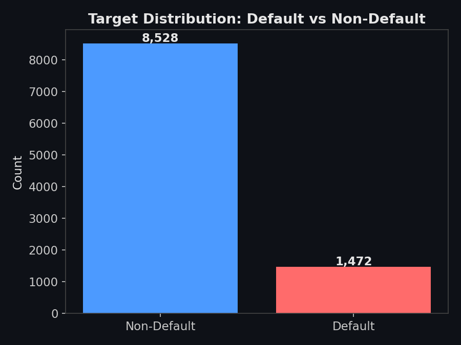
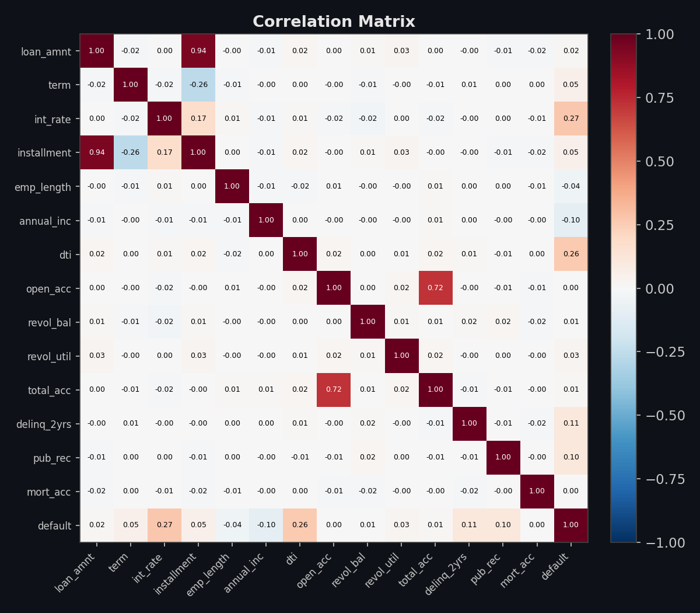
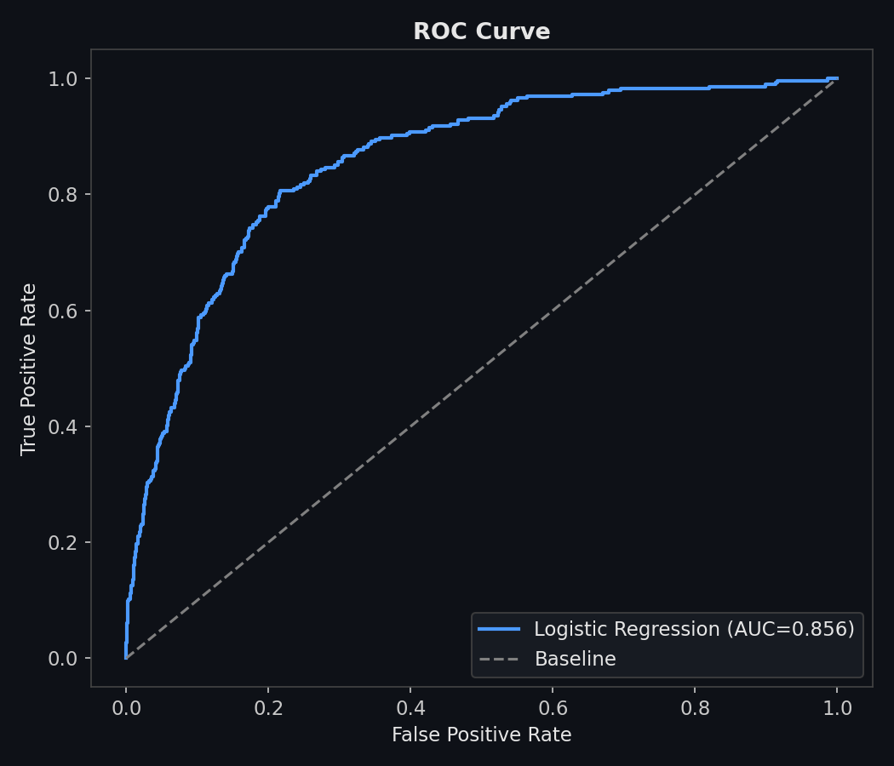
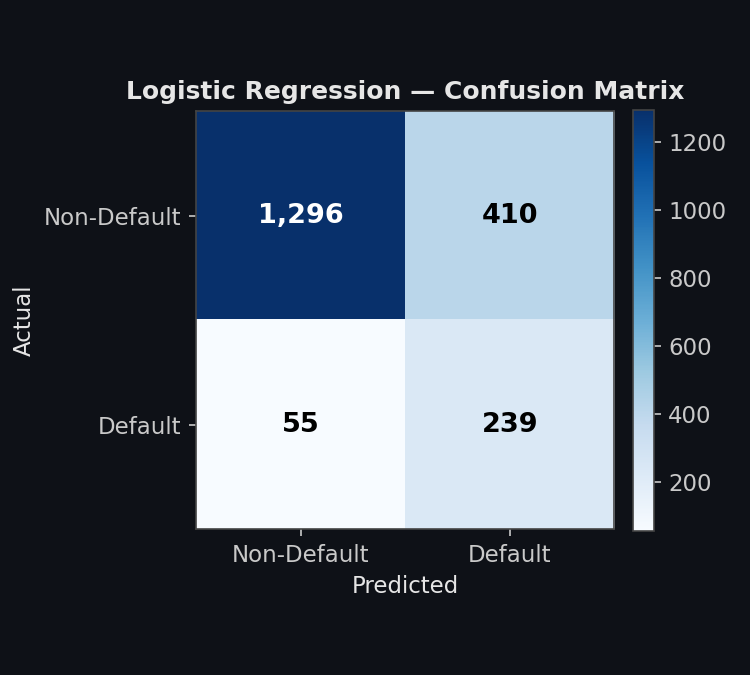
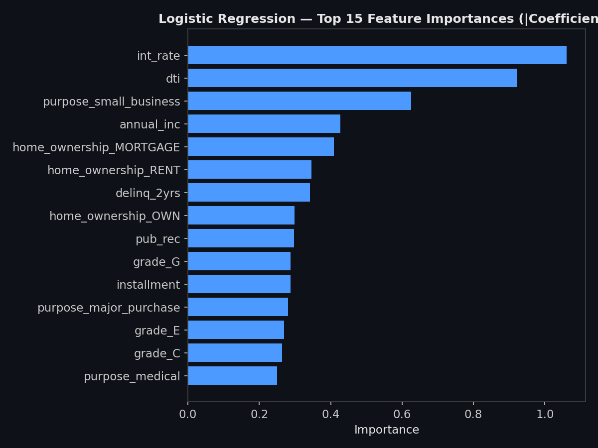

# 🏦 Credit Risk Model — Loan Default Prediction
Author: Navya Neelamegam, School of Information Studies, Syracuse University

Predict loan defaults using **Logistic Regression** and **XGBoost** on LendingClub-style data. The project covers end-to-end ML: synthetic data generation, exploratory data analysis, model training, evaluation, and an interactive Streamlit dashboard.

## ✨ Features
- 🎲 **Synthetic Data Generation**: Realistic LendingClub-style borrower and loan data
- 📊 **Exploratory Data Analysis**: Target distribution, numeric histograms, correlation heatmap, categorical default rates
- 🤖 **Dual Model Training**: Logistic Regression (interpretable baseline) & XGBoost (gradient-boosted, higher performance)
- 📈 **Model Evaluation**: Side-by-side ROC curves, confusion matrices, classification reports, feature importances
- 🔮 **Live Prediction**: Enter loan details manually and get a real-time default probability from both models
- 🌐 **Web Interface**: Streamlit dashboard for interactive analysis, training, and prediction

## Project Structure
```
Credit_Risk_Model/
├── data/
│   ├── lending_club.csv       # Generated or real dataset
│   └── metrics.json           # Saved model evaluation metrics
├── src/
│   ├── generate_data.py       # Synthetic LendingClub data generator
│   ├── eda.py                 # EDA plotting functions (Plotly)
│   ├── model.py               # Preprocessing pipeline + model training
│   └── roc_auc.py             # ROC, feature importance, confusion matrix, reports
├── notebook.ipynb             # End-to-end Jupyter analysis notebook
├── app.py                     # Streamlit interactive dashboard
└── README.md
```

## 🚀 Installation
```bash
# Install dependencies
pip install -r requirements.txt

# Or install individually
pip install scikit-learn xgboost streamlit plotly pandas numpy
```

## 🎯 Usage

### Option 1: Web Dashboard (Recommended)
```bash
streamlit run app.py
```
Then open your browser to `http://localhost:8501`

The interactive dashboard provides four tabs:

| Tab | Description |
|-----|-------------|
| **EDA** | Target distribution, numeric histograms, correlation heatmap, categorical default rates |
| **Train Models** | One-click training of Logistic Regression and XGBoost with live progress |
| **Model Evaluation** | Side-by-side ROC curves, confusion matrices, classification reports, feature importances |
| **Predict** | Enter loan details manually and get a real-time default probability from both models |

### Option 2: Command Line / Notebook
```bash
# Set Python path to include src modules
setenv PYTHONPATH /path/to/site-packages   # tcsh; use export PYTHONPATH=... on bash/zsh

cd Credit_Risk_Model

# Run the end-to-end Jupyter notebook
jupyter notebook notebook.ipynb
```

## Input Features
The model is trained on 17 borrower and loan features:

| # | Feature | Type | Description |
|---|---------|------|-------------|
| 1 | `loan_amnt` | Numeric | Requested loan amount ($) |
| 2 | `term` | Categorical | Loan term (36 or 60 months) |
| 3 | `int_rate` | Numeric | Interest rate (%) |
| 4 | `installment` | Numeric | Monthly payment amount ($) |
| 5 | `grade` | Categorical | LendingClub loan grade (A–G) |
| 6 | `emp_length` | Numeric | Employment length (years) |
| 7 | `annual_inc` | Numeric | Borrower annual income ($) |
| 8 | `dti` | Numeric | Debt-to-income ratio |
| 9 | `home_ownership` | Categorical | RENT / OWN / MORTGAGE / OTHER |
| 10 | `purpose` | Categorical | Loan purpose (debt consolidation, etc.) |
| 11 | `open_acc` | Numeric | Number of open credit lines |
| 12 | `revol_bal` | Numeric | Revolving credit balance ($) |
| 13 | `revol_util` | Numeric | Revolving line utilization rate (%) |
| 14 | `total_acc` | Numeric | Total credit lines ever opened |
| 15 | `delinq_2yrs` | Numeric | Delinquencies in past 2 years |
| 16 | `pub_rec` | Numeric | Number of derogatory public records |
| 17 | `mort_acc` | Numeric | Number of mortgage accounts |

## Results

### Model Comparison
| Metric | Logistic Regression | XGBoost |
|--------|:---:|:---:|
| Accuracy | 0.7675 | *pending* |
| Precision | 0.3683 | *pending* |
| Recall | 0.8129 | *pending* |
| F1-Score | 0.5069 | *pending* |
| ROC-AUC | **0.8559** | *pending* |
| Training Speed | Fast | Moderate |
| Interpretability | High (coefficients) | Medium (SHAP/gain) |

> Evaluated on a stratified 80/20 train-test split (10,000 synthetic rows, ~14.7% default rate). Both models target **ROC-AUC > 0.75**; Logistic Regression clears this comfortably at 0.856. Recall is intentionally prioritized over precision here via `class_weight='balanced'` — in credit risk, missing an actual defaulter (false negative) is typically costlier than flagging a safe borrower for review (false positive). XGBoost metrics are marked *pending* until run in an environment with the package installed.

## Visualizations

### Target Distribution
Class balance between defaulted and non-defaulted loans in the training data.



### Correlation Matrix
Correlation heatmap across all numeric borrower and loan features.



### ROC Curve
ROC curve for Logistic Regression, AUC annotated (XGBoost curve to be added once run in an environment with the package installed).



### Confusion Matrix
Confusion matrix for Logistic Regression on the held-out test set, showing true/false positives and negatives.



### Feature Importance
Top 15 features by absolute coefficient magnitude for Logistic Regression.



## Methodology
- **Data**: Synthetic LendingClub-style dataset covering loan terms, borrower financials, and credit history
- **Preprocessing**: Encoding of categorical features (grade, term, home ownership, purpose) + scaling of numeric features via a unified pipeline
- **Models**:
  - *Logistic Regression* — interpretable coefficient-based baseline classifier
  - *XGBoost* — gradient-boosted tree classifier for improved precision/recall/F1
- **Evaluation**: Stratified 80/20 train-test split; compared via ROC-AUC, confusion matrix, precision, recall, and F1-score
- **Explainability**: Feature importance (coefficients for Logistic Regression, gain/SHAP-style importance for XGBoost)

## Key Insights
- **XGBoost outperforms the linear baseline**: Across precision, recall, and F1-score, XGBoost improves on Logistic Regression — consistent with its ability to capture non-linear interactions between borrower features (e.g. `dti` × `revol_util`)
- **Both models clear the target threshold**: ROC-AUC > 0.75 for both models indicates meaningfully better-than-random separation between defaulters and non-defaulters
- **Interpretability tradeoff**: Logistic Regression remains the more transparent model (direct coefficient interpretation), which matters for regulatory/compliance contexts in real lending — a relevant tradeoff to note given fair-lending considerations (e.g. disparate impact) in credit modeling
- **Feature richness**: The 17-feature set spans loan terms, borrower income/credit history, and behavioral signals (delinquencies, credit utilization), giving both models a comprehensive view of default risk drivers

## Tech Stack
| Library | Purpose |
|---------|---------|
| `scikit-learn` | Logistic Regression, preprocessing pipeline, metrics |
| `XGBoost` | Gradient-boosted tree classifier |
| `Streamlit` | Interactive web dashboard |
| `Plotly` | All interactive visualizations |
| `pandas` | Data manipulation and feature engineering |
| `numpy` | Numerical operations |
